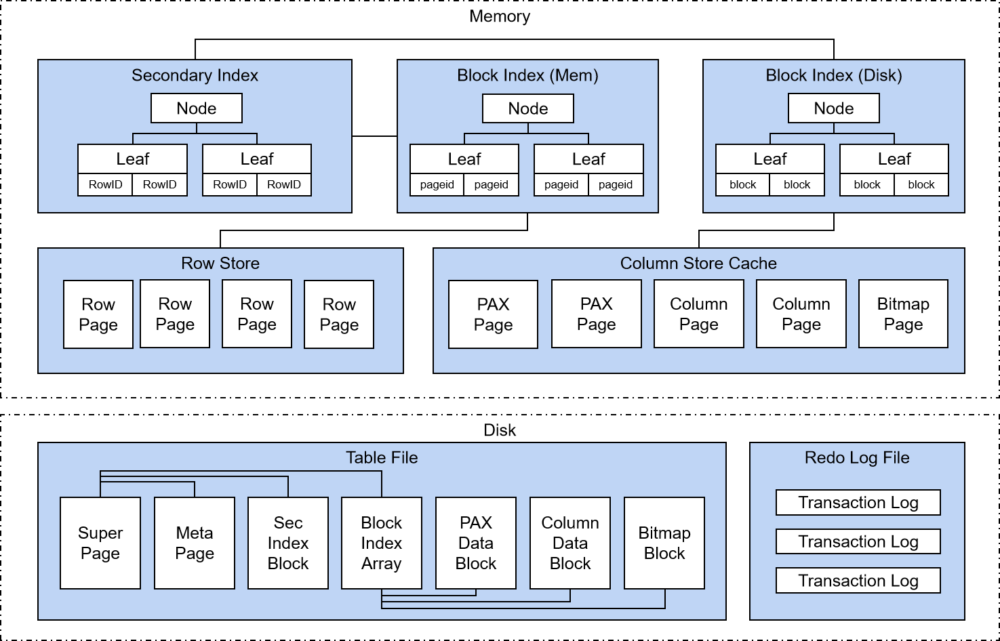
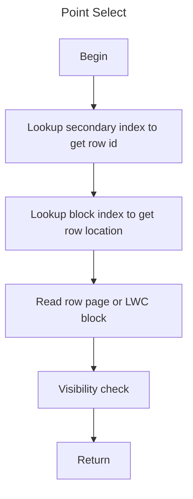
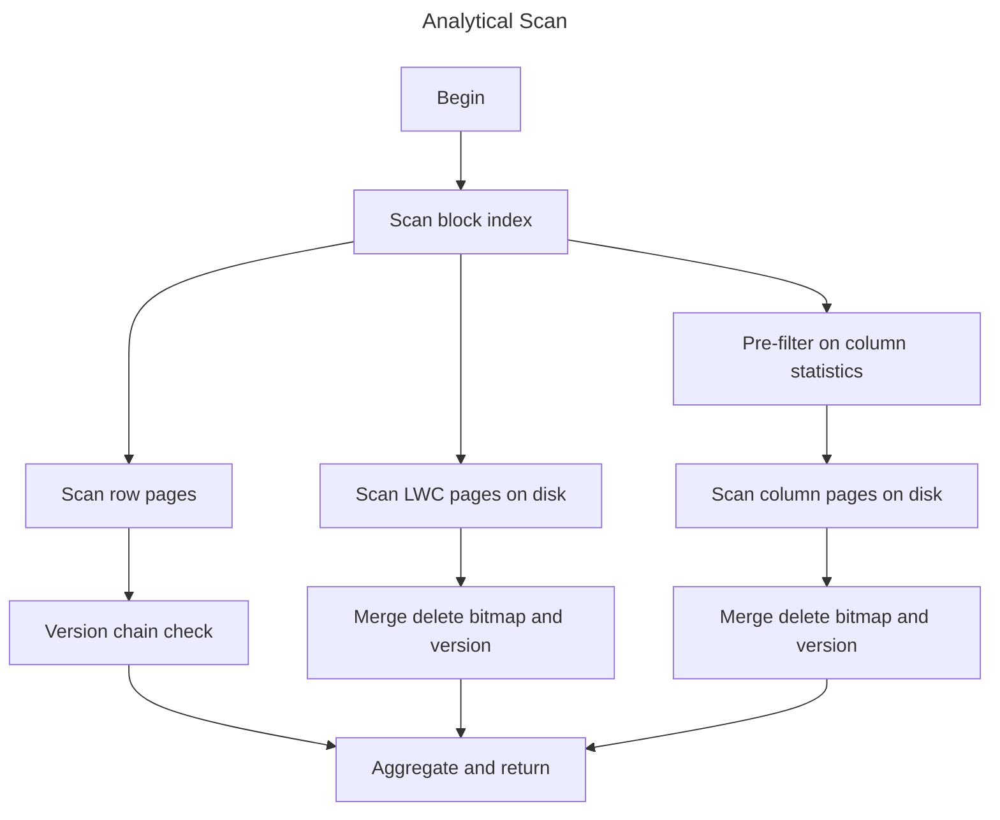
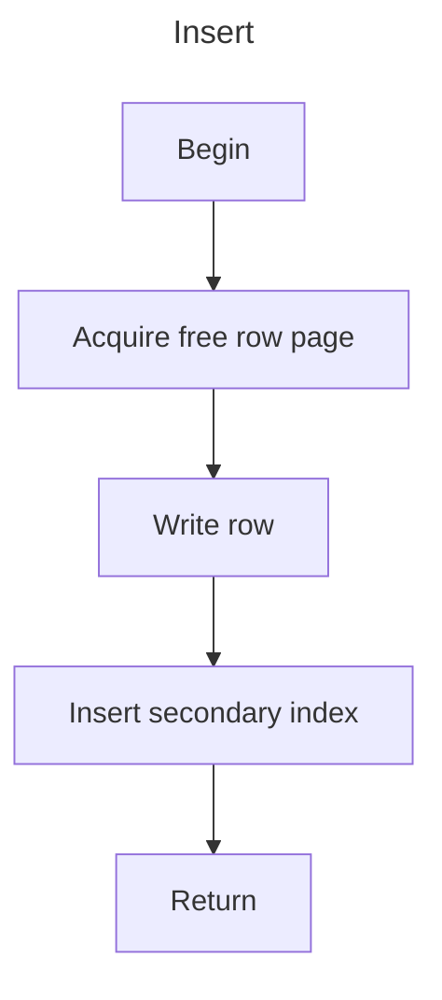
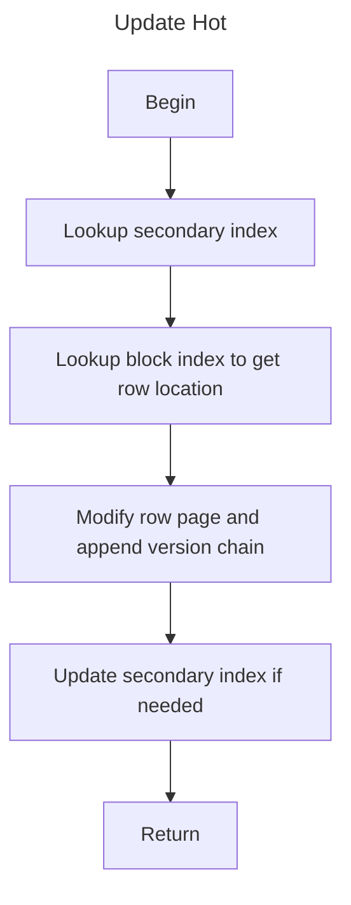
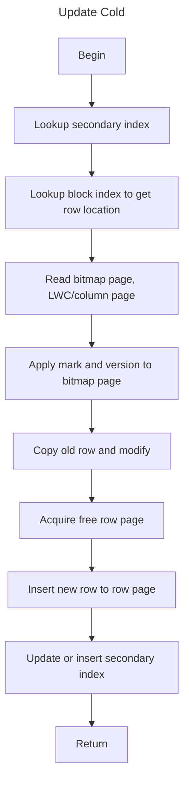
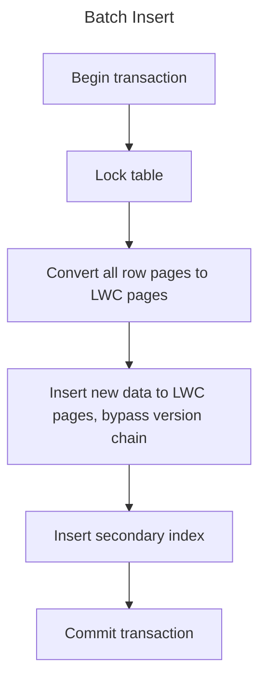

# Storage Architecture

## Overview

Doradb storage is designed for HTAP scenario.

For the storage-engine owner/runtime split, component registration order,
shutdown sequencing, and guard-lifetime rules, see
[Engine Component Lifetime](./engine-component-lifetime.md).

The storage has three data formats:

1. In-memory row pages.

In-memory row pages contain hot data which are processed by recent transactions.
Row pages support in-place updates.

2. LWC blocks on disk.

LWC(LightWeight Columnar) blocks on disk store warm data for persistence.
This kind of blocks apply lightweight columnar compression, such as bitpacking and dict, to support both fast scan and random access. 
Updates are converted to delete mask + insert. So there are also delete bitmaps stored accordingly.

3. Column blocks on disk(optional).

Column blocks on disk store cold data with columnar encoding.
They are transformed by background task to speed up analytical queries.
If the engine is used as a local storage, columnar encoding is preferred.
If the engine is used as an ingestion and query node, integration with object store is preferred.
So let's see what it can be in future.

### Row ID

When new data is coming, a unique identifier is assigned to each physical row
version, called **RowID**. A row version keeps its RowID wherever it is stored.

If an update happens in the in-memory RowStore and the row page can still hold
the new image, the modification is applied in place. The RowID is reused and
the previous values are stored in the version chain associated with that RowID.
If the page is frozen or cannot fit the update, the engine performs a hot move
update: the old hot RowID is marked deleted with row undo, the replacement
values are inserted into the RowStore with a new RowID, and runtime unique-key
branches preserve any older hot owner needed by active snapshots.

If an update targets a persisted row on disk, either in an LWC page or future
column page, the persisted row version is immutable. The engine installs a
cold-row delete marker for the old RowID, extracts and modifies the old values,
and inserts the replacement values into the RowStore with a new RowID. The old
cold RowID remains meaningful for MVCC visibility, rollback, recovery, and
secondary-index cleanup until no active snapshot can require it.

Secondary indexes are updated to make the latest logical key point to the new
RowID. For unique indexes, runtime unique-key links may also connect the new
hot version back to an older hot or cold owner so older snapshots can still
resolve the correct visible row.

### Block Index

**Block Index** is the indirection layer between stable **RowID** identity and
physical storage location.

It allows higher layers to keep using **RowID** even when data moves between
hot in-memory RowStore and cold persisted LWC blocks.

The design is split into:

- hot in-memory routing for RowStore pages
- cold persistent CoW routing for LWC blocks

The persistent side also carries cold-row delete payload and the binding needed
to resolve a cold row inside a persisted block.

For more details, see [Block Index Design](./block-index.md).

### Table File

**Table File** contians all persistent data of single table, including LWC pages, column pages, index pages and bitmap pages.

The principal of data modification in **Table File** is to do it in Copy-on-Write way. Despite of batch insert, background tasks will be executed periodically for row-to-column data transmission, delta merge of index and bitmap.

For more details, see [Table File](./table-file.md).

### Catalog Persistence

Catalog metadata remains cache-first at runtime: foreground lookups and DDL/DML
operate on the in-memory catalog tables, not on persisted catalog pages.
Durability is provided by a dedicated multi-table file, `catalog.mtb`, which
stores checkpointed roots for all logical catalog tables plus overlay metadata
such as `next_user_obj_id` and `catalog_replay_start_ts`.

User tables still persist to one file per table, but now use deterministic
fixed-width hex file names. `catalog.mtb` is reserved for the catalog-wide
checkpoint boundary and is published with the same CoW root-swap pattern used
by user-table files.

### Redo Log File

**Redo Log File** contains all committed data of recent transactions.

It's different from the concept of "WAL log" in tranditional database perspective, because it only persists committed data.

It does not contains "undo", therefore it does not support ARIES-style fuzzy checkpoint. The design of transactional system with logging and recovery will be introduced in a separate document.

### Secondary Index

**Secondary Index** is split into a hot in-memory `MemTree` and a persistent
CoW `DiskTree`.

- `MemTree` serves foreground writes and hot lookups.
- `DiskTree` stores checkpointed cold secondary-index state.
- `DiskTree` is updated only as companion work of table data/deletion
  checkpoint, not by an independent MemTree flush thread.

Unique and non-unique indexes use different physical models:

- unique indexes keep the latest logical-key mapping
- non-unique indexes keep exact entries keyed by logical key plus row id

For more details, see [Secondary Index Design](./secondary-index.md). The
overall index split is summarized in [Index Design](./index-design.md), and the
RowID-based routing layer is documented in [Block Index Design](./block-index.md).

## Transactional System

This system employs a unique persistence and recovery model (No-Steal / No-Force) that fundamentally differs from traditional ARIES algorithms (Steal / No-Force).

See [Transaction System](./transaction-system.md).

## Logging, Checkpoint and Recovery

This system adopts logging and recovery strategy of in-memory database system, which uses value logging and redo-only recovery.
Table-level checkpoint is applied to overcome shortcoming of in-memory database:
expensive checkponit and slow recovery time. Basically, a background task
converts row pages to LWC blocks periodically with CoW update on table file.
The LWC blocks and metadata can be treated as table-level checkpoint.

Catalog checkpointing follows the same replay-boundary idea. A catalog
checkpoint scans persisted redo from `catalog_replay_start_ts` through the
durable upper watermark, merges the catalog-row changes into `catalog.mtb`, and
publishes a new root with `catalog_replay_start_ts = safe_cts + 1`. On restart,
the engine first loads checkpointed catalog rows from `catalog.mtb`, then
preloads user tables from their table files, and finally replays only redo at
or after the coarse replay floor derived from `catalog_replay_start_ts`, loaded
tables' `heap_redo_start_ts` values, and loaded tables' `deletion_cutoff_ts`
values.

For more details, see [Checkpoint and Recovery](./checkpoint-and-recovery.md).

## Process Flow

### Point Select

### Analytical Scan

### Point Insert

### Update Hot

### Update Cold

### Batch Insert

