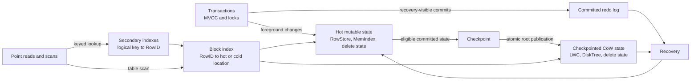

# Storage Architecture

Doradb is a storage engine for hybrid transactional and analytical processing
(HTAP). Its central design is to keep recent, frequently changed data in a
row-oriented memory layer while publishing older committed data into compact,
column-oriented files. The same tables and indexes span both layers.

This document explains the stable concepts, boundaries, and design rules of the
engine. It is the entry point for understanding how the pieces fit together;
the linked design documents are authoritative for formats, algorithms, and
runtime details.

## Architecture At A Glance

Foreground transactions operate on mutable in-memory state. Commit effects
that must survive restart are recorded in the redo log. Background checkpoints
convert eligible committed rows into immutable LWC (Lightweight Columnar)
blocks and publish the corresponding persistent index and deletion state
atomically through Copy-on-Write (CoW) roots.

Reads see one logical table across the hot and cold layers. Secondary indexes
resolve logical keys to `RowID`s, and the block index resolves each `RowID` to
its current in-memory or persisted location.

```mermaid
flowchart LR
    Tx["Transactions<br/>MVCC and locks"]
    Hot["Hot mutable state<br/>RowStore, MemIndex, delete state"]
    Redo["Committed redo log"]
    Checkpoint["Checkpoint"]
    Cold["Checkpointed CoW state<br/>LWC, DiskTree, delete state"]
    Reads["Point reads and scans"]
    Secondary["Secondary indexes<br/>logical key to RowID"]
    Block["Block index<br/>RowID to hot or cold location"]
    Recovery["Recovery"]

    Tx -->|foreground changes| Hot
    Tx -->|recovery-visible commits| Redo
    Hot -->|eligible committed state| Checkpoint
    Checkpoint -->|atomic root publication| Cold
    Reads -->|keyed lookup| Secondary
    Secondary --> Block
    Reads -->|table scan| Block
    Block --> Hot
    Block --> Cold
    Redo --> Recovery
    Cold --> Recovery
    Recovery --> Hot
```

## Architectural Principles

### Separate Mutable And Persistent State

Foreground writes modify the hot `RowStore`, in-memory index state, and
transient deletion state. They do not update persistent table or index pages
in place. Persisted structures are immutable or changed through CoW
publication, which keeps transaction latency independent of random
persistent-page updates.

### Persist Only Committed State

Doradb uses a No-Steal / No-Force persistence model:

- uncommitted state is not written into persistent table structures;
- a commit does not force table and index pages to their final locations; and
- recovery combines checkpointed committed state with committed redo, without
  an ARIES-style undo pass over persisted pages.

Undo information still exists in memory for transaction rollback and MVCC. It
is distinct from the committed redo used for crash recovery.

### Separate Logical Identity From Physical Placement

A `RowID` identifies a stored row entry independently of its current location.
Moving an entry from the hot layer into an LWC block preserves its `RowID`.
An update that replaces an entry may allocate a new `RowID`, while the old
entry remains available as long as transaction visibility requires it.

This separation lets indexes and readers address rows without embedding page
or block locations that checkpointing may change.

### Publish A Coherent Table State

Each table checkpoint publishes the table data, cold-row deletion state, and
persistent secondary-index changes required by that checkpoint through one
coherent root transition. A new root becomes visible only after its required
state has been written. Readers continue using an older captured root until
they can safely move to the new one.

### Give Accepted Work A Clear Owner

Preparation and admission for background operations remain caller-owned and
cancellable until the engine accepts the obligation. Once accepted,
maintenance and cleanup work is owned and supervised by the engine through
completion or a reported fatal failure. Finite synchronous and asynchronous
subtasks share worker resources, while their enclosing operations retain cleanup
and publication responsibility. Engine shutdown closes new admission and drains
accepted obligations in ownership order, keeping storage and eviction available
until the work that depends on them finishes.

## Storage And Identity Model

### Hot And Cold Rows

New rows enter the in-memory `RowStore`, which is optimized for transactional
access and maintains the MVCC history needed by active readers. Updates that
fit the hot representation can remain there.

Checkpointing freezes eligible hot rows and encodes their committed images as
LWC blocks. LWC is a lightweight compressed, column-oriented format designed
to support both scans and row lookup. Persisted rows are immutable: a
foreground update of a cold row records deletion state for the old entry and
places the replacement in the hot layer.

### Two Indexing Layers

Doradb deliberately separates two indexing responsibilities:

1. The **secondary index** maps a user key to one or more `RowID`s. Its mutable
   `MemIndex` covers hot changes, while its persistent `DiskTree` covers
   checkpointed state.
2. The **block index** maps a `RowID` to the physical row page or persisted LWC
   block that currently owns the entry.

Together they provide one access path across different storage formats.
Transaction and table access code, rather than the indexes alone, decides MVCC
visibility.

### Persistent Files

Each user table has a table file containing its checkpointed LWC data, block
index state, cold-row deletion state, and persistent secondary-index roots.
Updates create new blocks and metadata roots, then atomically switch the file
to the new root. Superseded blocks are reclaimed only after they are no longer
reachable by readers.

The catalog is kept in memory for foreground access and checkpointed into its
own multi-table file. Catalog and user-table recovery follow the same general
rule: load published CoW state, then apply the committed redo not already
covered by that state.

The redo log is separate from table files. It is an ordered, committed-only
record of effects that must survive restart until checkpointed state makes the
corresponding log history unnecessary.

## Core Data Flows

### Read

A keyed read searches the secondary index for candidate `RowID`s, resolves
their locations through the block index, and applies transaction visibility to
the hot or cold representations. A table scan plans work across both storage
layers, applies the same visibility rules, and combines the results into one
logical stream.

### Write And Commit

Inserts and replacement rows are written to the hot layer. Updates and deletes
record the in-memory history or deletion state needed by current transactions,
and mutable index effects are applied alongside the row change. Commit orders
the transaction and records any effect that must be recoverable before it is
covered by a checkpoint.

### Checkpoint

A table checkpoint selects eligible committed hot state, writes LWC blocks and
companion index or deletion changes, and publishes a new CoW root. Catalog
checkpointing similarly folds committed catalog changes into the catalog file.
Published replay boundaries allow covered redo to be excluded from future
recovery and eventually reclaimed.

### Recovery

Recovery loads the last valid catalog and user-table roots, replays the
remaining committed redo in the required order, and rebuilds volatile hot and
in-memory index state. Foreground access starts only after the recovered
catalog, table files, and runtime structures agree.

## Component Boundaries And Further Reading

| Area | Architectural responsibility | Detailed design |
| --- | --- | --- |
| Public API | Engine, session, transaction, data access, and maintenance contracts | [Public API](./public-api.md) |
| Transactions and concurrency | MVCC, commit ordering, rollback, locks, and visibility | [Transaction System](./transaction-system.md), [Lock System](./lock-system.md) |
| Indexing | Logical-key access and `RowID`-to-location routing | [Index Design](./index-design.md), [Secondary Index](./secondary-index.md), [Block Index](./block-index.md) |
| Table persistence | CoW table-file layout and durable table roots | [Table File](./table-file.md) |
| Durability | Committed redo, checkpoint publication, and restart reconstruction | [Redo Log](./redo-log.md), [Checkpoint](./checkpoint.md), [Recovery](./recovery.md) |
| Checkpoint maintenance | Hot-row conversion and cold-row deletion publication | [Data Checkpoint](./data-checkpoint.md), [Deletion Checkpoint](./deletion-checkpoint.md) |
| Memory and I/O | Page residency, eviction, and asynchronous direct I/O | [Buffer Pool](./buffer-pool.md), [Async I/O](./async-io.md) |
| Runtime lifecycle | Component ownership, accepted work, shutdown, and failure handling | [Engine Component Lifetime](./engine-component-lifetime.md), [Shutdown And Engine Poison](./shutdown-and-poison.md) |
| Reclamation | Removal of transaction history and unreachable storage state | [Garbage Collection](./garbage-collect.md) |
