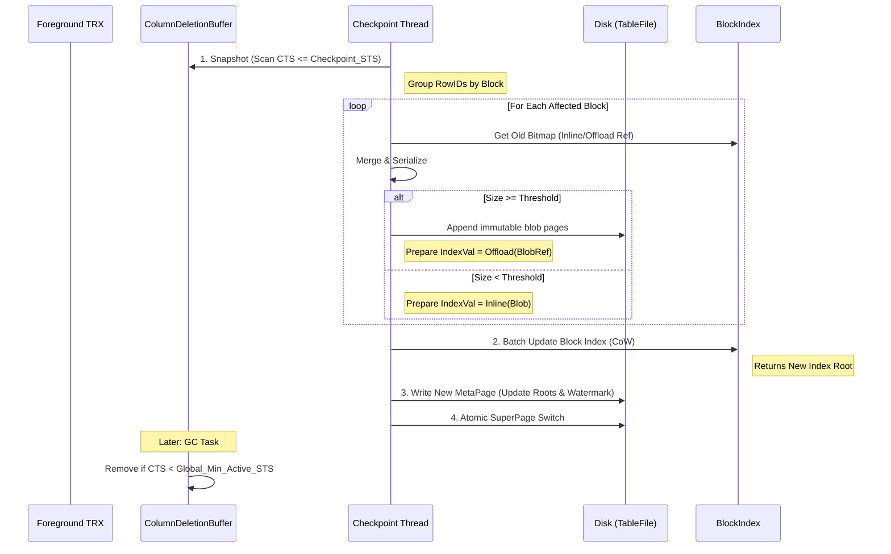

# Deletion Checkpoint

## 1. Overview

The **Deletion Checkpoint** subsystem is responsible for persisting row deletions and updates from the in-memory buffer to the immutable storage on disk.

In Doradb's HTAP architecture, data blocks (LWC Blocks) are immutable. Modifications are handled via a **Delete Bitmap** mechanism. The Deletion Checkpoint bridges the gap between the mutable, high-concurrency in-memory **ColumnDeletionBuffer** and the persistent, compressed **Table File**.

### Core Design Principles

1.  **No-Steal / No-Force**: Only committed data is persisted.
2.  **Pessimistic Disk Persistence**: The on-disk Bitmap represents a **superset** of all committed deletions.
    *   **Disk State**: "Physically Deleted".
    *   **Memory State**: "Logically Visible" (Undo information).
3.  **Hybrid Storage Layout**: Small bitmaps are inlined in the Block Index; large bitmaps are offloaded to immutable shared slotted blob pages.
4.  **Decoupled GC**: Persistence (I/O) is decoupled from Memory Garbage Collection (Visibility). Data remains in memory after flushing to serve as an Undo Log for active long-running transactions.

## 2. Data Structures

### 2.1 In-Memory: `ColumnDeletionBuffer`

A concurrent, sharded hash map serving as both the write buffer and the MVCC Undo cache.

```rust
struct ColumnDeletionBuffer {
    // Sharded for high concurrency (e.g., 64 shards)
    shards: Vec<RwLock<HashMap<RowID, DeletionEntry>>>,
}

struct DeletionEntry {
    sts: u64, // Start Timestamp of the modifier (Lock owner)
    
    // Atomic Transaction State Hook
    // Shared via Arc across all rows modified by the same transaction
    commit_state: Arc<AtomicU64>,
}
```

*   **Concurrency**: Uses sharded `RwLock` to minimize contention.
*   **Atomic Commit**: Transaction commit is $O(1)$. The transaction manager updates the `AtomicU64` inside the `Arc`, instantly making all associated rows "Committed" in the map.

### 2.2 On-Disk: Hybrid Bitmap Storage

We utilize a **Hybrid / Adaptive** strategy to manage `RoaringBitmap` persistence, leveraging the `Block Index` for navigation and immutable blob pages for bulk storage.

#### A. Block Index (Primary)
The Block Index Leaf Entry keeps either an inline deletion-delta list or an offloaded blob reference:

```rust
struct BlobRef {
    start_page_id: u64,
    start_offset: u16,
    byte_len: u32,
}
```

#### B. Deletion Blob Pages (Overflow)
*   **Implementation**: Immutable shared slotted blob pages in table file.
*   **Layout**: 64KB page with `(magic/version, next_page_id, used_size)` header + packed byte body.
*   **Reference**: `BlobRef` points to start page+offset and total byte length.
*   **Spill**: Large bitmaps can continue through linked pages (`next_page_id`).
*   **Reclaim**: Sweep/compaction is deferred to a dedicated follow-up task.

## 3. Transaction & Visibility Model

The visibility check logic determines whether a row is "alive" for a reader transaction $T_{reader}$.

**Logic**: `Visible = (Disk_Bitmap[Row] == 0) OR (Memory_Map[Row].CTS > T.STS)`

### The Read Path
1.  **Check Disk (Fast Path)**:
    *   Query Block Index. Get Bitmap (Inline or fetch via `BlobRef` from blob pages).
    *   If `Bitmap.contains(RowID) == false`: **Row is Visible**. (Return data).
2.  **Check Memory (Slow Path / Undo Path)**:
    *   *Condition*: Triggered only if `Bitmap.contains(RowID) == true`.
    *   Query `ColumnDeletionBuffer`.
    *   **Case A: Entry Not Found**:
        *   The delete was committed long ago and GC'd.
        *   **Result**: **Row is Deleted**.
    *   **Case B: Entry Found** (`Entry.CTS > T.STS`):
        *   The delete happened *after* $T_{reader}$ started.
        *   **Result**: **Row is Visible** (Undo).
    *   **Case C: Entry Found** (`Entry.CTS <= T.STS`):
        *   The delete happened *before* $T_{reader}$ started.
        *   **Result**: **Row is Deleted**.

## 4. Deletion Checkpoint Workflow

The process moves committed deletions from memory to disk. Crucially, the **System Transaction Timestamp (`Checkpoint_STS`)** defines the persistence boundary, ensuring that the recovery watermark advances even if data is sparse.

### Phase 1: Snapshot & Barrier
*   **Action**: The Checkpoint Coordinator starts a system transaction and acquires the current global timestamp: **`Checkpoint_STS`**.
*   **Semantic**: This timestamp acts as a **Read View**. The system guarantees that upon successful completion of this checkpoint, *all* deletions committed at or before `Checkpoint_STS` are persisted.
*   **Scan & Filter**:
    *   Iterate through `ColumnDeletionBuffer` shards.
    *   Collect `RowID`s where:
        1.  `commit_state` is **Committed** (CTS > 0).
        2.  `CTS <= Checkpoint_STS`.
*   **Output**: A list of RowIDs grouped by `LWC Block ID`.

### Phase 2: Merge & Encode (Pure Computation)
*   **Condition**: If the list from Phase 1 is empty, skip to **Phase 4 (Heartbeat Path)**.
*   **Action**: For each affected LWC Block:
    1.  **Load Old Bitmap**: Fetch from Block Index (Inline) or blob pages (Offload).
    2.  **Merge**: `New_Bitmap = Old_Bitmap | New_Deletes`.
    3.  **Optimize**: Serialize `New_Bitmap`.
        *   If `Size < Threshold`: Mark as `Inline`.
        *   If `Size >= Threshold`: Mark as `Offload`.

### Phase 3: CoW Persistence (I/O)
*   **Write Blob Pages** (Only for Offload blocks):
    *   Append serialized bytes into immutable shared slotted blob pages.
    *   Capture `BlobRef` for each updated block.
*   **Update Block Index**:
    *   Perform a **Batch Put** on the Block Index.
    *   Update values to inline deletion list or offloaded `BlobRef`.
    *   Generate new Block Index Root via CoW.

### Phase 4: Commit & Watermark Advancement
*   **Lock**: Acquire `SuperPage Lock`.
*   **New MetaPage**: Create a new `MetaPage`.
    *   Update `BlockIndexRoot` (if changed).
    *   **Crucial Update**: Set `Table.watermarks.deletion_rec_ts = Checkpoint_STS`.
    *   *Note*: This is set to the system timestamp acquired in Phase 1, regardless of the actual data timestamps.
*   **Persist**: Write MetaPage to disk.
*   **Switch**: Update `SuperPage` to point to the new MetaPage.

## Heartbeat Checkpoint (Log Truncation)

To prevent "cold" tables (tables with no recent deletions) from blocking the global truncation of the Redo Log, the system implements a Heartbeat mechanism.

*   **Problem**: If we relied on data timestamps (`Batch_Max_CTS`) for the watermark, a table with no writes would keep its `deletion_rec_ts` stuck in the past. The Log Manager cannot truncate logs older than `min(All_Tables.rec_cts)`, leading to disk exhaustion.
*   **Trigger**:
    *   Periodic timer (e.g., every minute) IF no regular Deletion Checkpoint has occurred.
    *   Or triggered explicitly by the Log Manager when log usage is high.
*   **Process**:
    1.  Acquire `Checkpoint_STS`.
    2.  Verify `ColumnDeletionBuffer` has no pending commits with `CTS <= Checkpoint_STS`.
    3.  **Fast Path**: Skip Phases 2 and 3 (No Data I/O).
    4.  **Meta Update**: Directly generate a new MetaPage with `deletion_rec_ts = Checkpoint_STS` and perform the SuperPage switch.
*   **Result**: The watermark advances, allowing the Log Manager to safely discard old logs.

## 5. Garbage Collection (Memory Cleanup)

A key distinction in this design is that **Flushing $\neq$ Cleaning**.
Memory entries are retained after the checkpoint to provide MVCC visibility (Undo) for active long-running transactions.

*   **Trigger**: Periodic background task or Memory Pressure.
*   **Condition**: An entry can be removed **only if**:
    $$ \text{Entry.CTS} < \text{Global\_Min\_Active\_STS} $$
*   **Logic**:
    1.  Acquire `Global_Min_Active_STS` from the Transaction Manager.
    2.  Scan `ColumnDeletionBuffer`.
    3.  Remove entries satisfying the condition.
    *   *Reasoning*: If the delete commit time is older than the oldest active transaction, then strictly **everyone** sees the row as deleted. The Disk Bitmap (which is a superset) is now the absolute truth, and the "Undo" info in memory is obsolete.


## 6. Crash Recovery

Recovery relies on the `deletion_rec_ts` as a strict **Persistence Barrier**.

1.  **Load State**: Read the latest valid MetaPage from SuperPage.
2.  **Determine Replay Start**:
    *   Retrieve `Replay_Start_CTS = MetaPage.deletion_rec_ts`.
    *   This timestamp guarantees that **any** transaction with `CTS <= Replay_Start_CTS` has already been processed (either persisted to the Bitmap or confirmed non-existent).
3.  **Log Replay**:
    *   The Log Reader scans entries starting from `Replay_Start_CTS`.
    *   **Filter**: Only replay delete operations where `Entry.CTS > Replay_Start_CTS`.
    *   **Action**: Insert these replayed entries into the `ColumnDeletionBuffer`.
4.  **Consistency**:
    *   The system is now consistent. The on-disk Bitmap acts as the base state, and the `ColumnDeletionBuffer` contains the "tail" of deletions that occurred after the last checkpoint (Heartbeat or Data) but before the crash.


## 7. Process Flow Diagram


