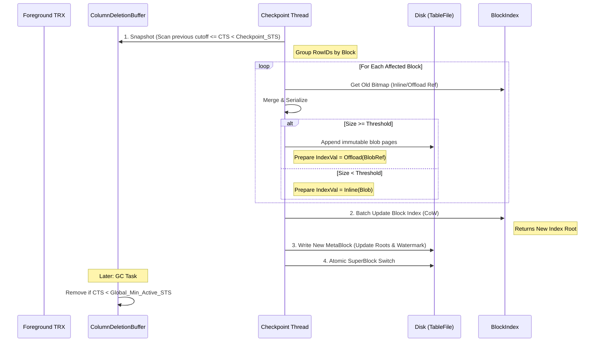

# Deletion Checkpoint

## 1. Overview

The **Deletion Checkpoint** subsystem is responsible for persisting row deletions and updates from the in-memory buffer to the immutable storage on disk.

In Doradb's HTAP architecture, data blocks (LWC Blocks) are immutable. Modifications are handled via a **Delete Bitmap** mechanism. The Deletion Checkpoint bridges the gap between the mutable, high-concurrency in-memory **ColumnDeletionBuffer** and the persistent, compressed **Table File**.

### Core Design Principles

1.  **No-Steal / No-Force**: Only committed data is persisted.
2.  **Commit-Only Disk Persistence**: The on-disk Bitmap represents committed
    deletes that have crossed the deletion checkpoint cutoff. Newer committed
    deletes remain in `ColumnDeletionBuffer` until a later checkpoint.
    *   **Disk State**: "Physically Deleted".
    *   **Memory State**: "Logically Visible" (Undo information).
3.  **Hybrid Storage Layout**: Small bitmaps are inlined in the Block Index; large bitmaps are offloaded to immutable shared slotted blob pages.
4.  **Decoupled GC**: Persistence (I/O) is decoupled from Memory Garbage Collection (Visibility). Data remains in memory after flushing to serve as an Undo Log for active long-running transactions.

## 2. Data Structures

### 2.1 In-Memory: `ColumnDeletionBuffer`

A concurrent table-level map serving as both the cold-row write ownership
record and the MVCC undo cache above persisted delete bitmaps.

```rust
struct ColumnDeletionBuffer {
    entries: DashMap<RowID, DeleteMarker>,
}

enum DeleteMarker {
    Ref(Arc<SharedTrxStatus>),
    Committed(TrxID),
}
```

*   **Concurrency**: Uses `DashMap` for concurrent foreground delete/update,
    rollback, purge, checkpoint selection, and recovery replay.
*   **Write Ownership**: An uncommitted `Ref` is the row-level ownership record
    for a cold delete/update. It also acts as the conflict point for other
    writers.
*   **Atomic Commit**: Transaction commit updates the shared transaction status
    observed by every `Ref` owned by that transaction. Maintenance paths may
    later compact a committed `Ref` into `Committed(cts)`.

### 2.2 On-Disk: Hybrid Bitmap Storage

We utilize a **Hybrid / Adaptive** strategy to manage `RoaringBitmap` persistence, leveraging the `Block Index` for navigation and immutable blob pages for bulk storage.

#### A. Block Index (Primary)
The Block Index Leaf Entry keeps either an inline deletion-delta list or an offloaded blob reference:

```rust
struct BlobRef {
    start_page_id: u64,
    start_offset: u16,
    byte_len: u32,
}
```

#### B. Deletion Blob Pages (Overflow)
*   **Implementation**: Immutable shared slotted blob pages in table file.
*   **Layout**: 64KB page with `(magic/version, next_page_id, used_size)` header + packed byte body.
*   **Reference**: `BlobRef` points to start page+offset and total byte length.
*   **Spill**: Large bitmaps can continue through linked pages (`next_page_id`).
*   **Reclaim**: Sweep/compaction is deferred to a dedicated follow-up task.

## 3. Transaction & Visibility Model

The visibility check logic determines whether a cold row is "alive" for a
reader transaction $T_{reader}$.

**Logic**: the in-memory marker is the newest authority when present; the
persisted bitmap is the base state when the marker is absent. A memory marker
can hide an uncheckpointed delete even when the disk bitmap is still clear, or
can make a disk-deleted row visible to an older snapshot when the marker's CTS
is newer than the reader snapshot.

### The Read Path
1.  **Check Memory Tail**:
    *   Query `ColumnDeletionBuffer` for the RowID.
    *   **Committed marker with `CTS <= T.STS`**: the delete is visible to the
        reader, so the row is deleted.
    *   **Committed marker with `CTS > T.STS`**: the delete happened after the
        reader started, so the old cold row remains visible as undo.
    *   **Uncommitted marker owned by the reader transaction**: the transaction
        already consumed the cold row, so the row is deleted for that
        transaction.
    *   **Uncommitted marker owned by another transaction**: readers keep
        snapshot visibility, while writers treat the marker as a write
        conflict.
2.  **Check Persisted Bitmap When No Marker Exists**:
    *   Query Block Index. Get Bitmap (Inline or fetch via `BlobRef` from blob
        pages).
    *   If `Bitmap.contains(RowID) == true`: the delete was committed,
        checkpointed, and no in-memory undo marker remains, so the row is
        deleted.
    *   If `Bitmap.contains(RowID) == false`: no memory or disk delete applies,
        so the row is visible.

## 4. Deletion Checkpoint Workflow

The process moves committed deletions from memory to disk. Crucially, the **System Transaction Timestamp (`Checkpoint_STS`)** defines the persistence boundary, ensuring that the recovery watermark advances even if data is sparse.

### Phase 1: Snapshot & Barrier
*   **Action**: The Checkpoint Coordinator starts a system transaction and acquires the current global timestamp: **`Checkpoint_STS`**.
*   **Semantic**: This timestamp acts as a **Read View**. The system guarantees that upon successful completion of this checkpoint, selected cold deletes below this exclusive cutoff are persisted.
*   **Scan & Filter**:
    *   Iterate through `ColumnDeletionBuffer`.
    *   Collect `RowID`s where:
        1.  the marker is committed, either `Committed(cts)` or committed `Ref`.
        2.  `previous_deletion_cutoff_ts <= CTS < Checkpoint_STS`.
        3.  `row_id < pivot_row_id`.
*   **Output**: A list of RowIDs grouped by `LWC Block ID`.

### Phase 2: Merge & Encode (Pure Computation)
*   **Condition**: If the list from Phase 1 is empty, skip to **Phase 4 (Heartbeat Path)**.
*   **Action**: For each affected LWC Block:
    1.  **Load Old Bitmap**: Fetch from Block Index (Inline) or blob pages (Offload).
    2.  **Merge**: `New_Bitmap = Old_Bitmap | New_Deletes`.
    3.  **Decode Rows Once**: Decode the affected LWC block once and
        reconstruct old row values for every selected RowID in this block.
    4.  **Build Secondary Deletes**: Decode old secondary-index keys from those
        reconstructed row values and append per-index companion `DiskTree`
        delete/update work:
        *   Unique indexes conditionally delete/update only when the stored
            owner still matches the deleted old RowID.
        *   Non-unique indexes remove the exact `(logical_key, old_row_id)`
            entry.
    5.  **Optimize**: Serialize `New_Bitmap`.
        *   If `Size < Threshold`: Mark as `Inline`.
        *   If `Size >= Threshold`: Mark as `Offload`.

This block-grouped reconstruction is the baseline algorithm. Row values for
deleted cold rows must remain reconstructible until the checkpoint publication
durably includes both the persistent delete metadata and the companion
secondary-index `DiskTree` delete/update work.

### Phase 3: CoW Persistence (I/O)
*   **Write Blob Pages** (Only for Offload blocks):
    *   Append serialized bytes into immutable shared slotted blob pages.
    *   Capture `BlobRef` for each updated block.
*   **Update Block Index**:
    *   Perform a **Batch Put** on the Block Index.
    *   Update values to inline deletion list or offloaded `BlobRef`.
    *   Generate new Block Index Root via CoW.
*   **Update Secondary DiskTrees**:
    *   Apply the per-index companion delete/update batches generated in Phase
        2.
    *   Generate new secondary-index `DiskTree` roots via CoW.

### Phase 4: Commit & Watermark Advancement
*   **Lock**: Acquire `SuperBlock Lock`.
*   **New MetaBlock**: Create a new `MetaBlock`.
    *   Update `BlockIndexRoot` (if changed).
    *   Update secondary-index `DiskTree` roots (if changed).
    *   **Crucial Update**: Set `Table.watermarks.deletion_cutoff_ts = Checkpoint_STS`.
    *   *Note*: This is set to the system timestamp acquired in Phase 1, regardless of the actual data timestamps.
*   **Persist**: Write MetaBlock to disk.
*   **Switch**: Update `SuperBlock` to point to the new MetaBlock.
*   **Atomic Outcome**: Persistent delete metadata and companion
    secondary-index `DiskTree` roots become visible together through the same
    MetaBlock.

## Heartbeat Checkpoint (Log Truncation)

To prevent "cold" tables (tables with no recent deletions) from blocking the global truncation of the Redo Log, the system implements a Heartbeat mechanism.

*   **Problem**: If we relied on data timestamps (`Batch_Max_CTS`) for the watermark, a table with no writes would keep its `deletion_cutoff_ts` stuck in the past. The Log Manager cannot truncate logs older than the minimum table replay boundary, leading to disk exhaustion.
*   **Trigger**:
    *   Periodic timer (e.g., every minute) IF no regular Deletion Checkpoint has occurred.
    *   Or triggered explicitly by the Log Manager when log usage is high.
*   **Process**:
    1.  Acquire `Checkpoint_STS`.
    2.  Verify the current scan has no eligible committed markers in
        `[deletion_cutoff_ts, Checkpoint_STS)`.
    3.  **Fast Path**: Skip Phases 2 and 3 (No Data I/O).
    4.  **Meta Update**: Directly generate a new MetaBlock with `deletion_cutoff_ts = Checkpoint_STS` and perform the SuperBlock switch.
*   **Result**: The watermark advances, allowing the Log Manager to safely discard old logs.

## 5. Garbage Collection (Memory Cleanup)

A key distinction in this design is that **Flushing $\neq$ Cleaning**.
Memory entries are retained after the checkpoint to provide MVCC visibility (Undo) for active long-running transactions.

*   **Trigger**: Periodic background task or Memory Pressure.
*   **Condition**: An entry can be removed **only if**:
    $$ \text{Entry.CTS} < \text{Global\_Min\_Active\_STS} $$
    and the delete is already covered by durable delete-bitmap state.
*   **Logic**:
    1.  Acquire `Global_Min_Active_STS` from the Transaction Manager.
    2.  Scan `ColumnDeletionBuffer`.
    3.  Remove entries satisfying the condition.
    *   *Reasoning*: If the delete commit time is older than the oldest active transaction and the delete has been checkpointed, then strictly **everyone** sees the row as deleted. The Disk Bitmap is now the absolute truth, and the "Undo" info in memory is obsolete.


## 6. Crash Recovery

Recovery relies on `deletion_cutoff_ts` as an exclusive **Persistence Barrier**.

1.  **Load State**: Read the latest valid MetaBlock from SuperBlock.
2.  **Determine Replay Start**:
    *   Retrieve `Deletion_Cutoff_TS = MetaBlock.deletion_cutoff_ts`.
    *   This timestamp guarantees that cold-row deletes with `cts < Deletion_Cutoff_TS` and `row_id < pivot_row_id` have already been processed (either persisted to the Bitmap or confirmed non-existent).
3.  **Log Replay**:
    *   The Log Reader scans entries starting from the coarse global replay floor.
    *   **Filter**: Only replay cold-row delete operations where `row_id < pivot_row_id` and `Entry.CTS >= Deletion_Cutoff_TS`.
    *   **Action**: Insert these replayed entries into the `ColumnDeletionBuffer`.
4.  **Consistency**:
    *   The system is now consistent. The on-disk Bitmap acts as the base state, and the `ColumnDeletionBuffer` contains the "tail" of deletions that occurred after the last checkpoint (Heartbeat or Data) but before the crash.


## 7. Process Flow Diagram


```mermaid
sequenceDiagram
    participant FG as Foreground TRX
    participant Mem as ColumnDeletionBuffer
    participant CP as Checkpoint Thread
    participant IO as Disk (TableFile)
    participant IDX as BlockIndex

    %% Phase 1
    CP->>Mem: 1. Snapshot (Scan previous cutoff <= CTS < Checkpoint_STS)
    Note right of CP: Group RowIDs by Block

    %% Phase 2 & 3
    loop For Each Affected Block
        CP->>IDX: Get Old Bitmap (Inline/Offload Ref)
        CP->>CP: Merge & Serialize
        alt Size >= Threshold
            CP->>IO: Append immutable blob pages
            Note right of CP: Prepare IndexVal = Offload(BlobRef)
        else Size < Threshold
            Note right of CP: Prepare IndexVal = Inline(Blob)
        end
    end

    CP->>IDX: 2. Batch Update Block Index (CoW)
    Note right of IDX: Returns New Index Root

    %% Phase 4
    CP->>IO: 3. Write New MetaBlock (Update Roots & Watermark)
    CP->>IO: 4. Atomic SuperBlock Switch

    %% GC (Independent)
    Note over Mem: Later: GC Task
    Mem->>Mem: Remove if CTS < Global_Min_Active_STS
```
