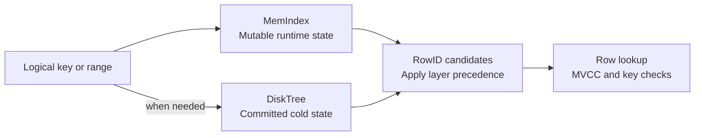

# Secondary Index

A secondary index maps logical keys to candidate `RowID`s for point lookups
and keyed scans. The block index has a different responsibility: it maps each
`RowID` to its physical row location.

This document describes user-table secondary indexes. Catalog indexes remain
memory-only; they do not use the persistent index layer described here.

## Secondary Indexes At A Glance

Each user-table index combines two layers:

- `MemIndex` is mutable in-memory state for recent changes, deletion overlays,
  and retained entries.
- `DiskTree` is a persistent Copy-on-Write (CoW) B+Tree containing committed
  cold index state.

Together they provide one logical access path. Memory state can be newer than
the persistent tree, so reads apply layer precedence before resolving row
visibility.

## Design Principles

### Keep Foreground Changes In Memory

Foreground row changes update `MemIndex` as part of the transaction. It can
contain uncommitted state, and rollback restores row and index effects
together. Writes may read persistent data or indexes, but do not modify
persistent index pages directly.

### Publish Consistent Table And Index State

Persistent index entries describe committed cold rows. Data checkpoints,
deletion checkpoints, and index DDL publish index roots together with the
corresponding table state, rather than exposing independent index updates.

An operation uses a consistent captured table root for its persistent data and
index state. Older roots remain protected while readers still need them.

### Treat Index Results As Candidates

An index hit is not proof that a row is visible. Multi-Version Concurrency
Control (MVCC) resolves visibility through row undo history and cold-row deletion
state. The resulting visible row must still match the lookup key or range.

Historical visibility belongs to the runtime transaction model. `DiskTree`
does not store a persistent chain of every past key owner or row version.

## Index Model

### Unique And Non-Unique Keys

| Index kind | Entry identity | Meaning |
| --- | --- | --- |
| Unique | Logical key | Maps the key to its latest owner `RowID`. |
| Non-unique | `(logical_key, RowID)` | Keeps a distinct entry for each row sharing the key. |

In `DiskTree`, these entries represent checkpointed cold state. It contains
live entries for that state, not a separate persistent deletion-marker layer.

A unique key's latest owner may not be the owner visible to an older snapshot.
When ownership moves between row chains, runtime history links keep the older
hot or cold owner reachable when ordinary row undo is insufficient. These links
remain only as long as transaction history requires them; they are not stored
in `DiskTree` or reconstructed as pre-crash history during recovery.

### Deletion Overlays

A memory entry can mark deleted or replaced ownership instead of disappearing
immediately. These deletion overlays prevent stale disk results from taking
precedence over newer runtime state.

A unique overlay retains the key's owner `RowID`; a non-unique overlay applies
only to one exact `(logical_key, RowID)` entry. Neither marker alone proves that
the row is invisible to every snapshot. Row history and deletion visibility
still decide what the reader can see.

## Core Access Flows

### Read

A unique point lookup checks `MemIndex` first. Any hit, including a deletion
overlay, selects the candidate from memory; it must not fall through to an
older `DiskTree` owner. Only a memory miss consults the captured disk root.

Non-unique keyed lookups combine both layers because either may contain
additional rows with the same logical key. Range scans also merge ordered
candidates from both layers. On equal entry identity, the memory candidate wins:
by logical key for unique indexes, or by `(logical_key, RowID)` for non-unique
indexes. This avoids returning duplicate copies of the same index entry.

Each candidate then goes through row-location routing, MVCC visibility, and
the final key or range check. Deletion overlays affect candidate selection,
not the reader's snapshot rules.

### Write

Inserts add entries for new hot rows. Updates change the affected mappings when
an indexed key or the row's `RowID` changes. Deletes mark row deletion and
mask the relevant memory entries. Old entries and history may remain needed
for rollback or older snapshots.

A cold-row update inserts a hot replacement and records deletion of the old
cold row. Matching old memory entries are masked when present. If a current
cold entry has no memory copy, no synthetic index overlay is needed: cold-row
deletion state filters its persistent candidate until deletion checkpointing.

Claiming a unique key validates the candidate owner through the row and
transaction ownership rules. A conflicting live owner produces a duplicate-key
error; competing uncommitted ownership can produce a write conflict. A stale
persistent mapping or a deletion overlay alone does not establish a duplicate.

Index effects settle with the enclosing statement and transaction. Commit does
not flush `MemIndex` into `DiskTree`.

## Persistence And Lifecycle

### Checkpoint

Data checkpointing derives index entries from the same committed rows written
into new cold blocks. It publishes their `DiskTree` roots with the table data
and routing metadata.

Deletion checkpointing removes persistent entries for committed cold-row
deletions and publishes those changes with the persistent deletion state.
For a unique key, it removes the entry only if the stored owner still matches
the deleted row. Deleting an old owner must not erase a newer row's claim to
the same key. Non-unique deletion removes only the exact key-and-row entry.

Secondary-index persistence is companion work of table checkpointing, not an
independent scan-and-flush of `MemIndex`.

### Index Creation And Drop

Index creation excludes conflicting table operations and builds from current
committed rows: hot rows populate `MemIndex`, while cold rows populate
`DiskTree`. Unique creation checks for duplicate keys across both layers.
Historical row versions are not build input.

The new index, table definition, and persistent roots are published through
coordinated DDL. A transaction cannot use an index absent from its
snapshot-visible schema. Dropping an index removes it from current use;
runtime and storage reclamation wait for the relevant reader, ownership, and
durable-publication conditions.

### Recovery

Recovery loads cold `DiskTree` roots from the published table state. After
redo reconstructs hot rows, it rebuilds their `MemIndex` entries. Replayed
cold-row deletions filter stale persistent candidates until a later checkpoint.

No separate index replay watermark is needed. Recovery restores the latest
committed state, not the historical visibility of transactions that existed
before the crash.

### Cleanup

Redundant live memory entries can be removed only when the persistent index
provides the equivalent mapping and readers using older roots no longer depend
on the memory copy. Safe entries may also be retained as a cache.

Deletion overlays require evidence that they are obsolete under the row and
deletion visibility rules. A row becoming cold, or the absence of an in-memory
deletion marker, is not sufficient by itself. Memory cleanup does not update
`DiskTree`.

Runtime history links follow transaction-history reclamation and the oldest
active snapshot, not memory-index cleanup. Old CoW pages and retired index
storage are reclaimed only after their respective ownership and reachability
conditions are satisfied.

## Component Boundaries And Further Reading

| Area | Responsibility | Further reading |
| --- | --- | --- |
| Index architecture | Separation of logical-key access and physical row routing | [Index Design](./index-design.md), [Block Index](./block-index.md) |
| Transactions | Visibility, current-row mutation, conflicts, and rollback | [Transaction System](./transaction-system.md) |
| Logical locking | Coordination with table operations and index DDL | [Lock System](./lock-system.md) |
| Checkpoint | Consistent publication of table and index state | [Checkpoint](./checkpoint.md) |
| Recovery | Reconstruction of cold and hot state after restart | [Recovery](./recovery.md) |
| Reclamation | Reader-safe cleanup of entries, history, and storage | [Garbage Collection](./garbage-collect.md) |
| Public API | Index definitions, keyed reads, mutations, and DDL | [Public API](./public-api.md) |
