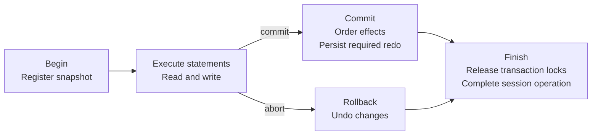

# Transaction System

Doradb's transaction system coordinates visibility, atomic changes, commit
ordering, and rollback. Reads and writes use one transaction model across hot
and cold storage, even as checkpointing changes physical placement.

This document explains the overall processing model and its guarantees.
[Storage Architecture](./architecture.md) provides the engine-wide context;
the documents linked below cover individual subsystems.

## Transaction Processing At A Glance

A session begins a transaction with a snapshot timestamp and executes
statements within it. Successful statements accumulate changes; commit
publishes their outcome, while rollback reverses them. Transaction locks remain
held until the required completion or cleanup finishes.

The normal lifecycle is:

Checkpointing and garbage collection proceed separately. Finishing a
transaction does not immediately persist its table pages or reclaim every
historical version it created.

## Design Principles

### Separate Visibility From Coordination

Multi-Version Concurrency Control (MVCC) determines which row version a reader
sees. Row write ownership detects competing changes. Logical locks protect
table definitions and coordinate table-level operations. These mechanisms
complement one another: a table lock does not replace MVCC or eliminate every
row write conflict.

### Separate Undo, Redo, And Checkpointing

Undo preserves the in-memory history needed for rollback and older readers.
Redo records committed effects that must survive restart. They serve different
purposes; undo is not part of the persistent recovery log.

Under the No-Steal / No-Force model, uncommitted row images do not enter
persistent table state, and commit does not force table or index pages to their
final locations. Redo provides foreground durability; checkpointing later
publishes committed data, index, and deletion state together.

### Keep Completion And Cleanup Owned

Transaction changes, locks, and cleanup obligations need an owner until they
are safely resolved. After commit or rollback is handed to the engine, its
completion cannot depend on the caller continuing to wait. A session becomes
available again only after its transaction's required cleanup and lock release.

## Transaction And Visibility Model

### Sessions, Transactions, And Statements

A session admits one transaction or other operation that changes state or
acquires locks at a time. A transaction is the unit of commit and rollback;
its statements execute sequentially and have their own error boundary.
Successful statement effects join the transaction, while an ordinary statement
failure can be undone without losing earlier successful statements.

DDL uses private catalog transactions within a separately owned operation.
That outer operation remains responsible for its locks and publication even
after its catalog transaction finishes.

### Timestamps And Row Visibility

A transaction has a stable identity and a start timestamp (STS) that defines
its read snapshot. Transactions requiring ordered commit also receive a commit
timestamp (CTS). Assigning a CTS reserves commit order; it does not by itself
mean the transaction has committed or its redo is durable.

Snapshot reads see the transaction's own changes and other transactions'
committed versions visible at its STS. When the latest image is too new or
uncommitted, MVCC reconstructs an older visible version or reports absence.

Mutation is a current-row operation: it acts on the latest modifiable image,
not on a historical image reconstructed for a snapshot read. It can therefore
observe newer committed changes. Snapshot reads do not imply serializable
execution; index-driven mutation has no predicate or gap locks to keep its
candidate range unchanged.

### Shared Read Snapshots

A shared read snapshot lets parallel readers scan a selected set of tables at
one timestamp, without a write transaction or read-your-own-write state. It
retains metadata protection, captured table roots, and an active snapshot
registration. Closing it stops new readers; protection remains until active
readers drain. A ready snapshot remains reusable between scans until closed.

## Core Processing Flows

### Begin And Execute

Beginning a transaction registers its snapshot so that background reclamation
preserves the history it may need. Tables are admitted as they are accessed,
rather than locking every table at transaction start.

First access acquires metadata protection and checks the snapshot-visible
schema against the current table definition. Writes require the current schema
version. Accepted metadata protection remains transaction-owned even if later
resolution or validation fails; successful admission is reused on later access.

Each successful statement adds its row, index, undo, and redo effects to the
transaction. They remain subject to whole-transaction rollback until commit.

### Read

A keyed read finds candidate `RowID`s through the secondary index and resolves
their locations through the block index. Hot-row visibility uses undo history;
cold-row visibility combines persisted deletion state with snapshot-aware
in-memory deletion markers. Index candidates alone do not establish visibility.

Point reads and table scans apply the same visibility model across both
storage layers. They acquire metadata protection but do not require a shared
table-data lock for ordinary MVCC reads.

### Write

The transaction acquires the required table-data protection before claiming
rows. An ordinary competing active writer causes a write conflict. If that
writer is already preparing to commit, the operation can wait for its outcome
and then retry against current state.

Inserts create hot rows. A hot update changes the row in place when possible,
or replaces it with a new hot entry. Cold rows are immutable: deletion records
an in-memory marker, and an update combines that deletion with a hot
replacement. A replacement may receive a new `RowID`.

Row and secondary-index changes are tracked together with the undo needed to
reverse them and the redo needed to recover committed effects. Older row and
key versions remain available while snapshot visibility requires them.

### Commit

The transaction's accumulated effects determine its commit path:

| Effects | Commit behavior |
| --- | --- |
| None, including read-only or lock-only work | Finish without assigning a CTS or writing redo; release transaction locks. |
| Runtime-only history or cleanup effects | Enter ordered commit and receive a CTS, but write no redo. |
| Recovery-visible effects | Enter ordered commit, receive a CTS, and write the required redo before publishing commitment. |

Ordered transactions share one commit sequence. Group commit batches logging
work; required redo writes and the configured synchronization policy complete
before the corresponding committed outcome is published. Commit does not wait
for a table checkpoint.

Successful commit publishes one outcome for the transaction's changes, then
releases transaction locks and completes the session operation. Undo and
related history needed by older readers pass to garbage collection rather than
being discarded immediately.

An ordered-only CTS is volatile. Effects that must survive restart need real
redo or durable checkpoint state; passing through commit order alone is not
durability.

### Rollback And Cancellation

An ordinary statement error reverses that statement's index and row changes
and discards its redo. Earlier successful statements remain in the transaction,
and accepted transaction locks remain held. The caller can continue using the
transaction or roll it back.

Whole-transaction rollback reverses accumulated changes and discards pending
redo before releasing transaction locks and completing the session operation.

Dropping a live transaction, or cancelling an in-flight non-streaming statement
after it has taken the transaction for execution, transfers the whole
transaction to engine-owned cleanup. Closing a read stream only ends that
stream; it does not roll back the transaction.

Once a commit is handed to ordered processing, stopping the caller's wait does
not cancel it. The engine owns both successful commit and cleanup if commit
fails. Likewise, stopping a rollback wait does not cancel accepted cleanup.

If rollback cannot safely complete, the engine enters a fatal failure state
(poison) and retains unresolved ownership. It does not report normal completion
or make that session reusable.

## Background Integration

### Checkpointing

Checkpointing moves eligible committed hot rows into persistent columnar
blocks and publishes their companion index and deletion state through a
coherent Copy-on-Write (CoW) root. It advances the durable coverage that allows
older redo to become unnecessary for recovery.

Small sessionless system transactions order internal storage work, such as
row-page creation and checkpoint completion, and connect it to redo and
reclamation. They are separate from the user transaction lifecycle.

### Recovery

Recovery loads checkpointed catalog and table state, then applies committed
redo not already covered by those checkpoints. It reconstructs hot rows,
in-memory index state, and newer cold-row deletions before foreground access
starts. There is no undo pass over uncommitted persistent rows, and volatile
transaction histories and logical locks are not restored.

### History Reclamation

The oldest active snapshot bounds when committed history becomes eligible for
reclamation. Transactions, shared read snapshots, and registered maintenance
readers all participate. Long-lived readers can therefore delay cleanup even
after the transactions that produced their versions have committed.

Garbage collection removes obsolete undo and index history and reclaims retired
storage only after the relevant reader and ownership conditions are satisfied.
A newer snapshot horizon makes cleanup possible; it does not prove that cleanup
has already finished.

## Component Boundaries And Further Reading

| Area | Responsibility | Detailed design |
| --- | --- | --- |
| Public API | Transaction, statement, stream, and shared-snapshot contracts | [Public API](./public-api.md) |
| Logical locking | Table protection, compatibility, ownership, and waiting | [Lock System](./lock-system.md) |
| Indexing | Candidate lookup, key ownership, and hot/cold index coordination | [Secondary Index](./secondary-index.md) |
| Redo | Ordered logging, group commit, synchronization, and failure handling | [Redo Log](./redo-log.md) |
| Checkpoint | Coherent publication of committed persistent state | [Checkpoint](./checkpoint.md) |
| Recovery | Restart ordering and reconstruction from durable state | [Recovery](./recovery.md) |
| Reclamation | Snapshot horizons and cleanup of obsolete history and storage | [Garbage Collection](./garbage-collect.md) |
| Runtime lifecycle | Accepted work, cleanup ownership, shutdown, and fatal failure | [Engine Component Lifetime](./engine-component-lifetime.md), [Shutdown And Engine Poison](./shutdown-and-poison.md) |
