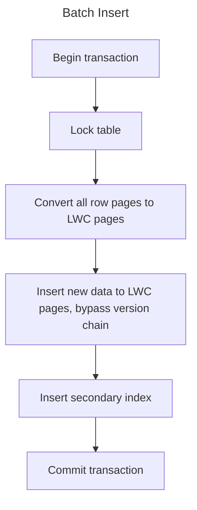

# Storage Architecture

## Overview

Doradb storage is designed for HTAP scenario.

The storage has three data formats:

1. In-memory row pages.

In-memory row pages contain hot data which are processed by recent transactions.
Row pages support in-place updates.

2. LWC pages on disk.

LWC(LightWeight Columnar) pages on disk store warm data for persistence.
This kind of pages apply lightweight columnar compression, such as bitpacking and dict, to support both fast scan and random access. 
Updates are converted to delete mask + insert. So there are also delete bitmaps stored accordingly.

3. Column pages on disk(optional).

Column pages on disk store cold data with columnar encoding.
They are transformed by background task to speed up analytical queries.
If the engine is used as a local storage, columnar encoding is preferred.
If the engine is used as an ingestion and query node, integration with object store is preferred.
So let's see what it can be in future.

### Row ID

When new data is coming, a unique identifier is assigned to each row, called **RowID**. wherever the data is located, **RowID** will not change.

If update happens in in-mem row store, modification will be applied directly on row page and the undo information will be stored in a version chain associated to that row.

If update target row on disk, either in LWC page or column page, the old data will be extracted and modified and re-inserted into row store in memory with a new **RowID**. Meanwhile a delete bit will be applied to bitmap page cache associated to that data page on disk. And also in such scenario, the secondary index will be updated to point to new **RowID**.

### Block Index

**Block Index** is introduced to manage data among the three layouts, with the help of **RowID**.

**Block Index** is basically a specialized B+Tree stores mapping from **RowID** range to page id or block id.

For data in in-memory row store, it only stores page id.

For data on disk, it stores block id with some statistics, which can be used for data skipping.

### Table File

**Table File** contians all persistent data of single table, including LWC pages, column pages, index pages and bitmap pages.

The principal of data modification in **Table File** is to do it in copy-on-write way. Despite of batch insert, background tasks will be executed periodically for row-to-column data transmission, delta merge of index and bitmap from transaction logs.

### Redo Log File

**Redo Log File** contains all committed data of recent transactions. It's different from the concept of "WAL log" in tranditional database perspective, because it only persists committed data. It does not contains "undo", therefore it does not support ARIES-style fuzzy checkpoint. The design of transactional system with logging and recovery will be introduced in a separate document.

### Secondary Index

**Secondary Index** is a B+Tree index. It stores mapping between key and row id.
The secondary index is composite of two trees: **MemTree** and **DiskTree**.
**MemTree** is similar to a MemTable in LSM architecture, it holds new data inserted and hot data which are frequently updated. A background task will transfer **MemTree** to **DiskTree** as part of the checkpoint process.

**DiskTree** is a CoW B+Tree which supports fast lookup, scan and batch inserts. Small transactions will be combined as large batch and modify the **DiskTree** in a CoW way. New root will be created and updated in metadata. In such way, no logging is required for recovery.

Query on index will execute on both tree and aggregate their results.

## Transactional System

See [Transaction System](./transaction-system.md).

## Process Flow

### Point Select

### Analytical Scan

### Point Insert

### Update Hot

### Update Cold

### Batch Insert

